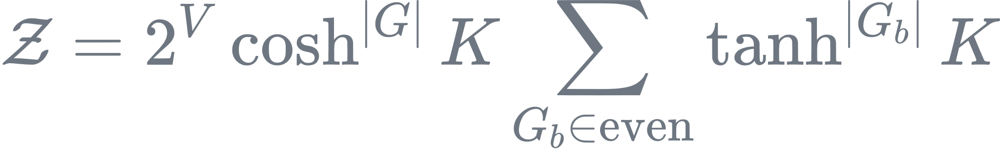

# High-dimensional Ising model

This Monte Carlo simulation program is designed to simulate the Ising model in its loop representation.

The partition function of the loop representation on a lattice graph $G$ can be written as
<div align="center">
  
</div>
where $V$ is the number of vertices, $|G|$ is the total number of lattice bonds, and $G_b$ is a subset of the lattice graph $G$. The notation $G_b \in \mathrm{even}$ denotes the summation over even graphs, and $|G_b|$ represents the number of bonds in the graph $G_b$. The parameter $K = \beta J$ is the coupling strength of the Ising model.

The update scheme is based on the lifting technique; see the paper: [Phys. Rev. E 97, 042126](https://journals.aps.org/pre/abstract/10.1103/PhysRevE.97.042126)

**Note that the complete version of the code is located in `old_version/`, which is written in Fortran. For convenience, the C++ version in `src/` only implements the configuration update function.**

## How to use

1. Clone the repository:
    ```bash
    git clone https://github.com/Tensofermi/HD_Ising_IrrWorm
    cd HD_Ising_IrrWorm
    ```

2.  Set parameters in `input.txt` and run the simulation:
    ```
    ./run.sh
    ```

3. For advanced simulations, including job submissions on HPC systems, refer to the `/lsub`, `/qsub` and `/data` directories in our related project:  [Zoo_of_Classical_ON_Spin_Model.](https://github.com/Tensofermi/Zoo_of_Classical_ON_Spin_Model)


## Citation
If you use this code or refer to our results in your research, please cite:
``` TEXT
@article{PhysRevE.109.034125,
  title = {Finite-size scaling of the high-dimensional Ising model in the loop representation},
  author = {Xiao, Tianning and Li, Zhiyi and Zhou, Zongzheng and Fang, Sheng and Deng, Youjin},
  journal = {Phys. Rev. E},
  volume = {109},
  issue = {3},
  pages = {034125},
  numpages = {10},
  year = {2024},
  month = {Mar},
  publisher = {American Physical Society},
  doi = {10.1103/PhysRevE.109.034125},
  url = {https://link.aps.org/doi/10.1103/PhysRevE.109.034125}
}
```
